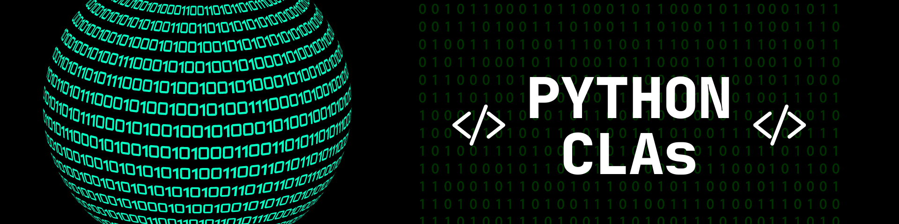

Tiny CLI apps that I coded while learning Python

## Simple Calculator
A basic calculator app that performs basic arithmetic operations on 2 given numbers. The division function even returns the quotient (and remainder wherever applicable)!

## Quadratic Equation Solver
A compact app that solves the quadratic equation and returns the roots.

## Spherical Lens/Mirror Solver
A small app that can solve numericals involving spherical mirror/lens's image distance, object distance and focal length.

## Take a Guess
A fun app that generates a random number between 1-10 and asks you to take a guess!
